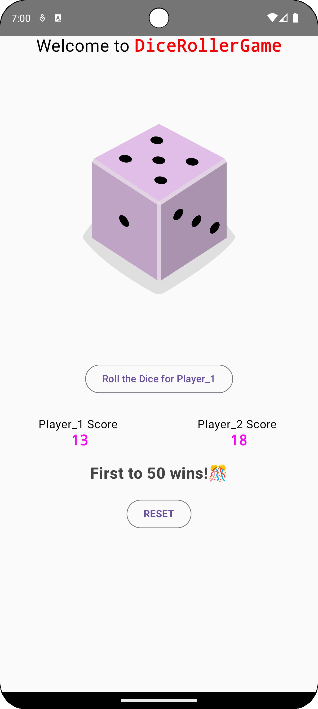
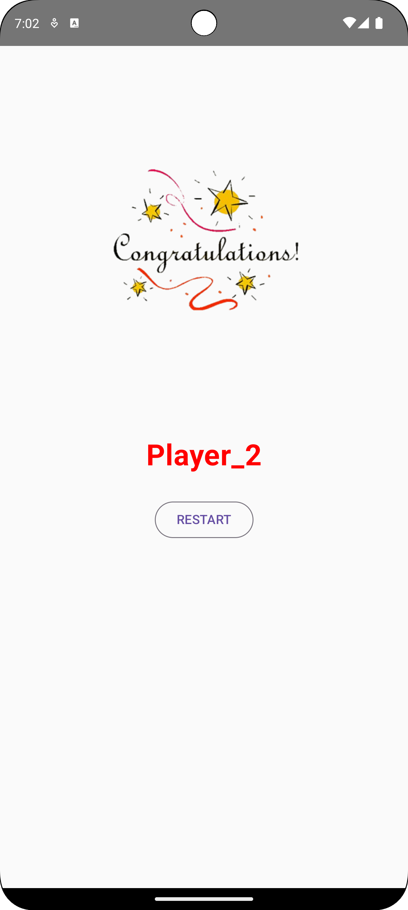
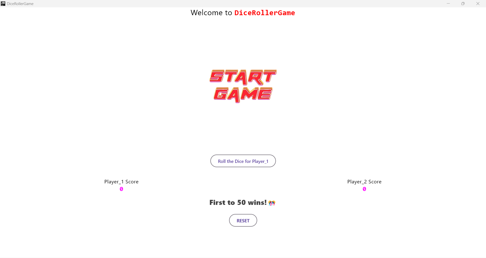
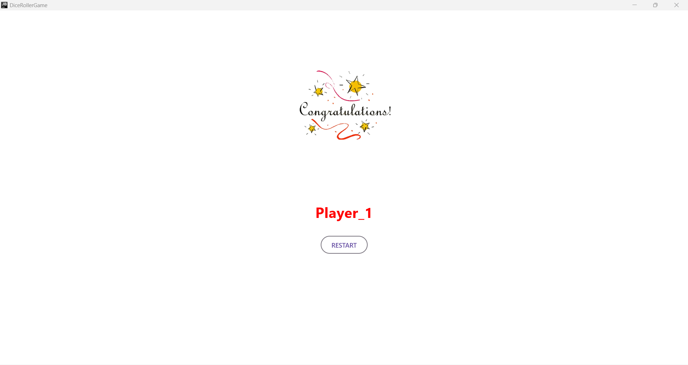

# 🎲 DiceRollerGame - A Kotlin Multiplatform Dice Game

**DiceRollerGame** is a **Kotlin Multiplatform (KMP)** two-player game where players take turns rolling a dice. The first player to reach **50 points** wins! 🏆 This game runs on both **Android** and **iOS**, sharing business logic between platforms.

---

## 📸 Screenshots

**Android**

<p align="center">
  
  
</p>

**Desktop**

<p align="center">
  
  
</p>

---

## 🎮 Features
✅ **Turn-based dice rolling**  
✅ **Two-player multiplayer mode**  
✅ **First player to reach 50 points wins**  
✅ **Cross-platform support (Android, iOS & Desktop)**  
✅ **Simple and user-friendly UI**  

---

## 🚀 Getting Started

Follow the instructions below to **clone, build, and run** the project on both Android and iOS.

### **1️⃣ Prerequisites**
- **Android Studio** (for Android development)
- **Xcode** (for iOS development)
- **Kotlin Multiplatform (KMP) setup**

### **2️⃣ Clone the Repository**
Open a terminal and run:
```bash
git clone https://github.com/mrkaran007/DiceRollerGame.git
cd DiceRollerGame
```

## 📱 Running the Game

### 🔹 Running on Android
1. Open **DiceRollerGame** in **Android Studio**.
2. Select an **emulator or physical device**.
3. Click **Run** ▶️.

### 🔹 Running on iOS
1. Open **DiceRollerGame** in **Xcode**.
2. Select an **iPhone Simulator**.
3. Click **Build & Run** ▶️.

### 🔹 Running on Desktop (Windows, macOS, Linux)
1. Open the project in **IntelliJ IDEA** or **Android Studio**.
2. Select the **desktop target**.
3. Click **Run** ▶️ to start the game.

---

## 🛠️ Tech Stack
- **Kotlin Multiplatform (KMP)** - Shared logic between Android & iOS
- **Jetpack Compose (Android)** - Modern UI for Android
- **SwiftUI (iOS)** - Native UI for iOS
- **Ktor** (Networking, if applicable)
- **Coroutines** (For async tasks)

---

## 🎲 How to Play?
1. Players take turns **rolling the dice** 🎲.
2. The **dice result is added** to the player’s total score.
3. The **first player to reach 50 points** wins the game! 🏆

---

## 📌 Future Improvements
🚀 **Single-player mode** (AI opponent)  
🚀 **Online multiplayer support**  
🚀 **Improved animations & UI enhancements**  
🚀 **Leaderboard & score tracking**  

---

## 🤝 Contributing

We welcome contributions! 🎉 If you’d like to improve the game, follow these steps:

1. **Fork** the repository.
2. **Create a new branch**:  
  ```bash
   git checkout -b feature/your-feature-name
 ```
3. **Make your changes and commit them**:
  ```bash
   git commit -m "Added a new feature"
 ```
4. **Push to the branch**:
```bash
git push origin feature/your-feature-name
```
5. **Open a Pull Request (PR) and submit your changes.**:

---

## 📄 License

This project is licensed under the **MIT License**. See the [`LICENSE`](LICENSE) file for details.  

---

## 📣 Contact & Support

🔹 **Created by** [Karan](https://github.com/mrkaran007)  
🔹 **GitHub Repository:** [DiceRollerGame](https://github.com/mrkaran007/DiceRollerGame.git)  
🔹 Feel free to **star ⭐ this repository** if you find it useful!  


